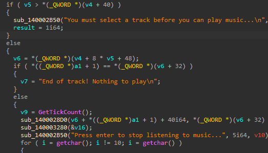
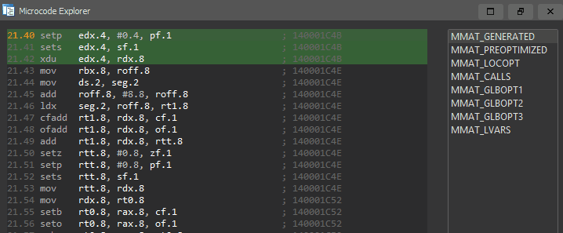
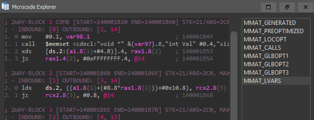
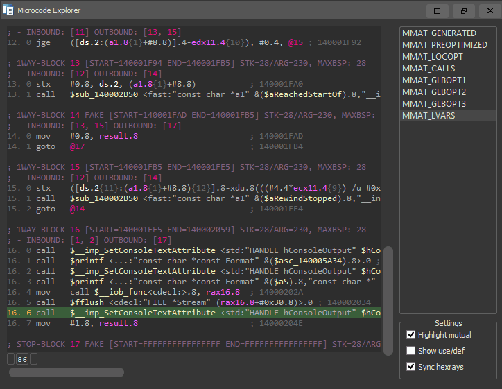

# Lucid - An Interactive Hex-Rays Microcode Explorer

## Overview

Lucid is a developer-oriented [IDA Pro](https://www.hex-rays.com/products/ida/) plugin for exploring the Hex-Rays microcode. It was designed to provide a seamless, interactive experience for studying microcode transformations in the decompiler pipeline.

This plugin is labeled only as a prototype & code resource for the community. Please note that it is a development aid, not a general purpose reverse engineering tool. 

Special thanks to [genmc](https://github.com/patois/genmc) / [@pat0is](https://twitter.com/pat0is) et al. for the inspiration.

## Releases

* v0.1 -- Initial release

## Installation

Lucid is a cross-platform (Windows, macOS, Linux) Python 2/3 plugin. It takes zero third party dependencies, making the code both portable and easy to install.

1. From your disassembler's python console, run the following command to find its plugin directory:
   - **IDA Pro**: `os.path.join(idaapi.get_user_idadir(), "plugins")`

2. Copy the contents of this repository's `/plugins/` folder to the listed directory.
3. Restart your disassembler.

This plugin is only supported for IDA 7.5 and newer.

## Usage

Lucid will automatically load for any architecture with a Hex-Rays decompiler present. Simply right click anywhere in a Pseudocode window and select `View microcode` to open the Lucid Microcode Explorer.

By default, the Microcode Explorer will synchronize with the active Hex-Rays Pseudocode window.

## Lucid Layers

Lucid makes it effortless to trace microinstructions through the entire decompiler pipeline. Simply select a microinstruction, and *scroll* (or click... if you must) through the microcode maturity layer list.

Watch as the explorer stays focused on your selected instruction, while the surrounding microcode landscape melts away. It's basically magic.

## Sub-instruction Granularity

Cursor tracing can operate at a sub-operand / sub-instruction level. Placing your cursor on different parts of the same microinstruction can trace sub-components back to their respective origins.

If the instructions at the traced address get optimized away, Lucid will attempt to keep your cursor in the same approximate context. It will change the cursor color from green to red to indicate the loss of precision.

## Sub-instruction Trees

As the Hex-Rays microcode increases in maturity, the decompilation pipeline begins to nest microcode as sub-instructions and sub-operands that form tree-based structures. 

You can view these individual trees by right clicking an instruction and selecting `View subtree`.

## Known Bugs

As this is the initial release, there will probably a number of small quirks and bugs. Here are a few known issues at the time of release:

* When opening the Sub-instruction Graph, window/tab focus can change unexpectedly
* Microcode Explorer does not dock to the top-level far right compartment on Linux?
* Switching between multiple Pseudocode windows in different functions might cause problems
* Double clicking an instruction address comment can crash IDA if there is no suitable view to jump to
* Plugin has not been tested robustly on Mac / Linux
* ...?

If you encounter any crashes or bad behavior, please file an issue.

## Future Work

Time and motivation permitting, future work may include:

* Clean up the code.......
* Interactive sub-instruction graph generalization (to pattern_t / rules)
* Microcode optimizer development workflow?
* Microcode optimization manager?
* Ctree explorer (and similar graph generalization stuff...)
* Microcode hint text?
* Improve layer translations
* Improve performance
* Migrate off IDA codeview?
* ...?

I welcome external contributions, issues, and feature requests. Please make any pull requests to the `develop` branch of this repository if you would like them to be considered for a future release.

## Authors

* Markus Gaasedelen ([@gaasedelen](https://twitter.com/gaasedelen))
